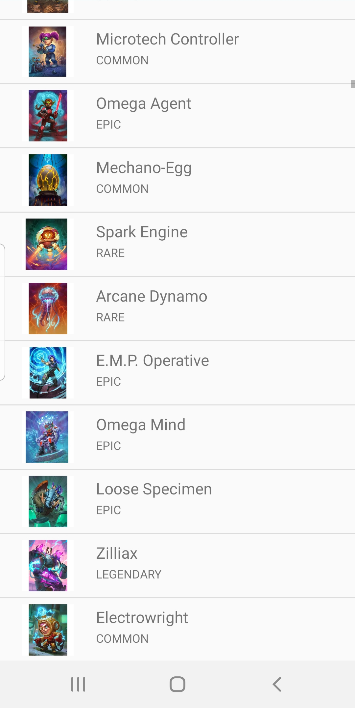
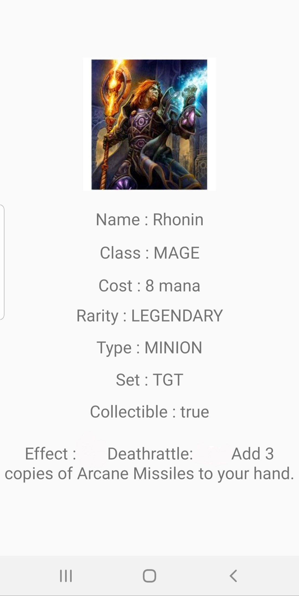

# Application Hearstone

## Présentation

Projet démontrant l'utilisation du pattern MVC dans une application android codé en Java.

Cette application affiche l'ensemble des cartes du jeu hearstone et utilise une API.

## Prérequis


- Installation d'Android Studio

````
https://github.com/Xcuby/Projet_Mobile_Final.git
````

## Consignes respectées : 

- Appels REST
- Ecrans : 3 activités
- Affichage d'une liste dans un RecyclerView
- Affichage du détail d'un item de la liste
- Fonctions supplémentaires :
  - Architecture MVC
  - Début d'un Gitflow
  - Stockage des données en cache (sharedPreferences)
  - SplashScreen
  - Animation entre SplashScreen et la liste (disparition progressive)

## Fonctionnalités: 

### Premier écran 

- SplashScreen affichant une image d'introducton Hearstone

                            

### Ecran Home 

- Affiche la liste des cartes avec :
  - Image de la carte
  - Nom de la carte en titre
  - Rareté de la carte en sous-titre

                            

### Ecran du détail de la carte

- Affiche les différentes informations sur la carte qui sont :
  - Image de la carte
  - Nom de la carte en titre
  - Coût en mana de la carte
  - Rareté de la carte
  - Type de la carte
  - Extension d'où provient la carte
  - Si elle est encore créable
  - Effet de la carte

                            
