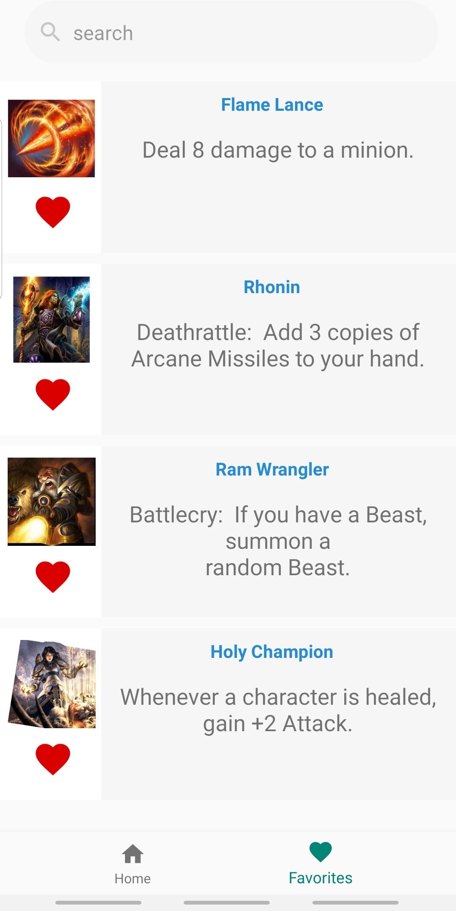

# Application Hearstone

## Présentation

Projet démontrant l'utilisation du pattern MVC dans une application android codé en Java.

Cette application affiche l'ensemble des cartes du jeu hearstone et utilise une API.

## Prérequis


- Installation d'Android Studio

````
https://github.com/Xcuby/Projet_Mobile_Final.git
````

## Consignes respectées : 

- Appels WebService à une API REST
- Ecrans : 3 activités (dont une avec deux fragments)
- Affichage d'une liste dans un RecyclerView
- Affichage du détail d'un item de la liste
- Fragment
- Design :
    - Barre de recherche
    - RecyclerView et ses éléments
    - Ecran du détail de la carte
- Architecture MVC
- GIT

- Fonctions supplémentaires :
  - Début d'un Gitflow
  - Stockage des données en cache (sharedPreferences)
  - SplashScreen
  - Animation entre SplashScreen et la liste (disparition progressive)
  - Implémentation de Fabric (crash analytics)
  - APK de l'application (dans la racine du projet)
  - Tests Unitaires
  - Clean Architecture
  - Barre de recherche sur les deux fragments (Home et favoris)
  - Ajout/suppression de cartes dans les favoris (également stocké en cache) avec un simple appui sur le coeur correspondant à l'élément
  

## Fonctionnalités: 

### Premier écran 

- SplashScreen affichant une image d'introduction Hearstone


### Fragment Home 

- Affiche de toute la liste des cartes avec :
  - Image de la carte
  - Nom de la carte en titre
  - Description de la carte
  - Son appartenance ou non aux favoris (carte favorite si le coeur rouge est plein)
  


### Fragment Favoris

- Affichage de la liste des cartes favorites avec :
  - Image de la carte
  - Nom de la carte en titre
  - Description de la carte
  - Coeur rouge plein (car il s'agit seulement des cartes favorites)
  


### Défilement de la liste

Eléments de la liste apparaissant progressivement en mode balayage de gauche à droite


### Barre de recherche 

Recherche d'un élément dans la liste en fonction de son nom et de l'entrée utilisateur dans la barre de recherche. L'apparition des élements lors de la recherche se fait comme dans le défilement de la liste.


### Ecran du détail de la carte

- Avec une image de fond de l'ambiance d'Hearstone et la police (et couleur), affiche les différentes informations sur la carte qui sont :
  - Image de la carte
  - Nom de la carte en titre
  - Coût en mana de la carte
  - Rareté de la carte
  - Type de la carte
  - Extension d'où provient la carte
  - Si elle est encore créable
  - Effet de la carte


